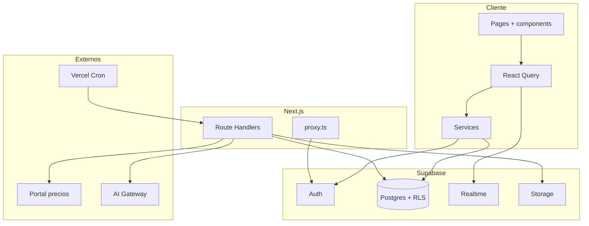

# Arquitectura técnica — Cordillera

Stack, capas, seguridad y flujos principales del sistema.

---

## Stack

| Capa | Tecnología |
| --- | --- |
| Framework | Next.js 16 (App Router, Turbopack en dev) |
| Lenguaje | TypeScript 5 |
| UI | React 19, Tailwind CSS 4, shadcn/ui + Radix |
| Estado servidor | TanStack React Query 5 |
| Formularios | react-hook-form + Zod |
| Backend | Supabase (Postgres, Auth, RLS, Realtime, Storage) |
| Auth SSR | @supabase/ssr (cookies) |
| Jobs | Vercel Cron (sync de precios) |
| IA | Vercel AI Gateway — OCR de facturas escaneadas |
| Parsing | unpdf (PDF nativo), xlsx (Excel) |
| Tests | Vitest |
| Deploy | Vercel + Supabase hosted |

---

## Arquitectura



**Lecturas:** componente → hook → service → Supabase (anon key) → Postgres con RLS según el JWT.

**Escrituras privilegiadas** (ingesta, admin, cron): Route Handlers con service role.

**Archivos:** upload server-side a Storage; la tabla guarda `archivo_path`.

---

## Estructura del código

```
src/
├── app/           # login, dashboard, api/
├── components/    # UI por dominio
├── hooks/         # React Query
├── services/      # Acceso a Supabase (cliente)
├── lib/           # Lógica de dominio (ingesta, precios, avisos, auth)
├── types/         # Tipos y unions de roles/estados
└── proxy.ts       # Auth y guard de rutas

supabase/          # Migraciones SQL
```

Convenciones: `services/` para queries/mutations; `hooks/` envuelven React Query; `lib/` con lógica reutilizable; unions tipadas con switches exhaustivos.

---

## Autenticación y roles

Login email/contraseña vía Supabase Auth. Perfil en `profiles` con campo `role`.

**Roles:** `admin`, `compras`, `ventas`.

**Autorización en tres capas:**

1. **Postgres (RLS)** — función `auth_role()` en policies.
2. **Rutas** — `proxy.ts` redirige si el rol no tiene acceso al área.
3. **UI** — menú y acciones filtrados por `canAccess(role, area)`.

| Área | Roles |
| --- | --- |
| dashboard | todos |
| facturas, órdenes, revisión | admin, compras |
| categorías, precios | admin, compras; ventas solo lectura |
| usuarios, ajustes | admin |
| avisos | admin, compras |

---

## Modelo de datos

| Grupo | Tablas | Propósito |
| --- | --- | --- |
| Identidad | `profiles` | Rol por usuario |
| Compras | `proveedores`, `proveedor_alias` | Matching de proveedor en ingesta |
| Categorías | `rubros`, `rubro_alias` | Categorías canónicas y alias |
| Facturas | `facturas`, `factura_items`, `pagos` | Ingesta, cuenta corriente |
| Órdenes | `ordenes_compra` | Seguimiento de pedidos |
| Precios | `precios` | Lista diaria del portal |
| Avisos | `avisos` | Notificaciones pendientes/resueltas |
| Revisión | `revision_queue` | Cola human-in-the-loop |
| Config | `settings` | Umbrales y preferencias |

**Extensiones:** `pg_trgm` para similaridad de strings en matching de proveedor y rubro.

**Funciones relevantes:** `match_proveedor`, `match_rubro`, `merge_rubros`, `recompute_factura_estado_pago` (trigger en pagos), `auth_role`.

**Vistas:** `v_facturas` (saldo y pagado), `v_gasto_por_rubro`.

**Realtime:** tabla `avisos` — invalida cache de React Query ante cambios.

**Storage (privado):** buckets `facturas` y `ordenes`; acceso vía Route Handlers con URLs firmadas.

---

## Flujos principales

### Ingesta de facturas

Upload → extracción (PDF / Excel / OCR) → deduplicación por hash → matching de proveedor (umbral 0.55) → insert o cola de Revisión → opcional guardado en Storage.

Por debajo del umbral, duplicado o dato incompleto: `en_revision` + ítem en `revision_queue`. Sin clave de AI Gateway, los escaneados van a Revisión manual.

### Revisión

Cola genérica con tipos: proveedor ambiguo, posible duplicado, dato incompleto, categoría ambigua. La resolución actualiza la entidad y cierra el ítem.

### Pagos

Insert en `pagos` → trigger recalcula `estado_pago` y saldo. No se edita el estado de pago manualmente.

### Precios

Cron diario (Vercel) o sync manual: login HTTP al portal del proveedor, fetch JSON, upsert por `codigo_producto` + `fecha_lista`. Fallo → aviso de sistema.

### Notificaciones

Al entrar al dashboard se sincronizan avisos (órdenes demoradas, fallos de precios). Campana en header con popover; bandeja completa en `/dashboard/avisos`. Realtime sobre `avisos`.

---

## API server

Route Handlers para: ingesta y CRUD de facturas, archivos de facturas/órdenes, sync y cron de precios, ABM de usuarios (admin). Todas validan rol con `requireArea()` o equivalente.

---

## Variables de entorno

| Variable | Uso |
| --- | --- |
| `NEXT_PUBLIC_SUPABASE_URL` | URL del proyecto |
| `NEXT_PUBLIC_SUPABASE_ANON_KEY` | Cliente browser + RLS |
| `SUPABASE_SERVICE_ROLE_KEY` | Server only |
| `CRON_SECRET` | Bearer para cron de precios |
| `PORTAL_URL`, `PORTAL_USER`, `PORTAL_PASSWORD` | Portal del proveedor |
| `AI_GATEWAY_API_KEY` | OCR (opcional) |

---

## Despliegue y calidad

App en Vercel; cron de precios en UTC (ver `vercel.json`).

### Base de datos (Supabase)

Las migraciones viven en `supabase/` numeradas del `001` al `017`. En un proyecto
nuevo:

1. SQL Editor → ejecutar cada archivo en orden.
2. Verificar buckets privados **facturas** y **ordenes** en Storage (crearlos en el
   dashboard si no existen; no hay migración SQL para ellos).
3. Configurar las variables de entorno en Vercel (mismas que local + `CRON_SECRET`).

Para desarrollo local: crear proyecto, migrar, `npm run seed`, `npm run dev`. Pasos
resumidos en el [README del repo](../README.md).

```bash
npm run typecheck
npm run lint
npm run test
npm run build
```

Tests unitarios en extracción de facturas y cliente del portal de precios.

---

## Decisiones clave

- **RLS en Postgres** como fuente de verdad de permisos.
- **Cola de Revisión genérica** — un solo inbox human-in-the-loop.
- **Matching conservador (0.55)** — preferir confirmación humana.
- **Montos `NUMERIC(14,2)`** — sin floats.
- **Estado de pago por trigger** — derivado de pagos registrados.
- **Ingesta en server** — archivos y OCR nunca en el cliente.
- **Precios vía HTTP JSON** al portal — sin automatización de browser.
